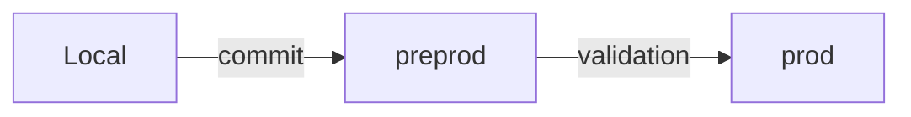

# Projet WordPress + Docker + Git + CI/CD

---

## 📌 Sommaire
- Présentation du projet
- Prérequis
- Configuration initiale
- Initialisation du submodule
- Gestion des environnements & synchronisation
- Structure des branches Git
- Personnalisation
- CI/CD & Déploiement automatique
- Dépannage
- Sécurité & bonnes pratiques
- Traefik
- Duplication machine à machine
- Documentation du thème kd-com

---

## Présentation du projet
Ce projet permet de créer, configurer et déployer un site WordPress avec Docker, Traefik et Git, en utilisant des scripts automatisés pour une gestion facile des environnements (local, préprod, prod).

---

## Prérequis
- Docker et Docker Compose installés
- Git installé
- Accès sudo pour modifier `/etc/hosts`

---

## Configuration initiale
1. Cloner le dépôt
   ```bash
   git clone https://github.com/votre-compte/wp-docker-git-project.git
   cd wp-docker-git-project
   ```
2. Rendre les scripts exécutables
   ```bash
   chmod +x scripts/*.sh
   ```
3. Configurer le projet
   ```bash
   ./scripts/01-setup-project.sh 
   ```
4. Démarrer Docker
   ```bash
   docker compose up -d
   ```
5. Installer Wordpress
   ```bash
   ./scripts/02-init-wp.sh
   ```
 
6. Installer ACF PRO
# 🔧 Initialisation du sous-module ACF Pro

## Prérequis

Assurez-vous d'avoir accès au repo privé `https://github.com/kd-com/acf-pro.git`  
(clé SSH ou token GitHub configuré sur la machine).

---

## 1. Après un `git clone` du projet

```bash
git submodule update --init --recursive
```

---

## 2. Vérifier l'état du sous-module

```bash
git submodule status
```

| Préfixe | Signification |
|---|---|
| `-` | Non initialisé |
| `+` | Commit différent du parent |
| ` ` | OK |

---

## 3. Mettre à jour le sous-module (dernière version)

```bash
git submodule update --remote wp-content/plugins/advanced-custom-fields-pro
```

---

## 4. En cas de problème d'accès SSH

Vérifiez que votre clé SSH est bien ajoutée à GitHub :

```bash
ssh -T git@github.com
```

Ou basculez en HTTPS si vous utilisez un token :

```bash
git config submodule.wp-content/plugins/advanced-custom-fields-pro.url https://github.com/kd-com/acf-pro.git
git submodule update --init
```

---

## 5. Pour les prochains clones (one-liner)

```bash
git clone --recurse-submodules <url-du-repo>
```

---

## Gestion des environnements & synchronisation

### Variables à renseigner dans `.env`
```dotenv
# Préprod
PREPROD_USER=
PREPROD_HOST=
PREPROD_PATH=
PREPROD_DB_USER=
PREPROD_DB_PASS=
PREPROD_DB_NAME=
CPANEL_API_TOKEN=
# Prod
PROD_USER=
PROD_HOST=
PROD_PATH=
PROD_DB_USER=
PROD_DB_PASS=
PROD_DB_NAME=
```

### Synchronisation multi-environnements
Les scripts `sync-db.sh` et `sync-file.sh` permettent de synchroniser la base de données et les fichiers avec le serveur distant, en choisissant l'environnement.

**Utilisation** :
- Préprod :
  ```bash
  ./scripts/sync-db.sh pull preprod
  ./scripts/sync-db.sh push preprod
  ./scripts/sync-file.sh pull preprod
  ./scripts/sync-file.sh push preprod
  ```
- Prod :
  ```bash
  ./scripts/sync-db.sh pull prod
  ./scripts/sync-db.sh push prod
  ./scripts/sync-file.sh pull prod
  ./scripts/sync-file.sh push prod
  ```

---

## Structure des branches Git
| Branche    | Environnement   | Déclenchement CI/CD                |
|------------|-----------------|------------------------------------|
| prod       | Production      | Déploiement automatique sur prod   |
| preprod    | Préproduction   | Déploiement automatique sur préprod|
| main       | Dev/Template    | Pas de déploiement automatique     |
| feature/*  | Local           | Pas de déploiement automatique     |

---

## Personnalisation
- Thème enfant : `wp-content/themes/mon-child-theme/`
- Config WordPress :
  - Local : `wp-config/wp-config-local.php`
  - Préprod : `wp-config/wp-config-preprod.php`
  - Prod : `wp-config/wp-config-prod.php`

---

## CI/CD & Déploiement automatique

### Variables à renseigner dans GitHub (Secrets)
#### Préprod (o2switch)
| Nom du secret         | Description                                 |
|----------------------|---------------------------------------------|
| PREPROD_USER         | Utilisateur cPanel/SSH                      |
| PREPROD_HOST         | Adresse du serveur                          |
| PREPROD_PATH         | Chemin cible sur le serveur                 |
| SSH_PRIVATE_KEY      | Clé privée SSH (contenu, pas le chemin)     |
| CPANEL_API_TOKEN     | Jeton API cPanel pour whitelist SSH         |
#### Prod (classique)
| Nom du secret         | Description                                 |
|----------------------|---------------------------------------------|
| PROD_USER            | Utilisateur SSH                             |
| PROD_HOST            | Adresse du serveur                          |
| PROD_PATH            | Chemin cible sur le serveur                 |
| SSH_PRIVATE_KEY      | Clé privée SSH (contenu, pas le chemin)     |

### Fonctionnement du workflow
- **Préprod (o2switch)** : Ajout IP à la whitelist SSH via l’API cPanel, installation de la clé SSH, synchronisation du dossier `kd-com` avec `rsync`.
- **Prod (classique)** : Installation de la clé SSH et synchronisation du dossier `kd-com` sans whitelist.

---

## Dépannage
| Problème                        | Solution                        |
|----------------------------------|---------------------------------|
| Docker ne démarre pas            | `docker-compose logs`         |
| Erreur de connexion à la BDD     | Vérifiez `.env` et `docker-compose ps` |
| /etc/hosts non modifié           | `sudo nano /etc/hosts`        |
| Erreur de permissions            | `chmod +x scripts/*.sh`       |

---

## Sécurité & bonnes pratiques
- Ne versionnez jamais les fichiers contenant des secrets ou des accès : `.env`, `wp-config/*.php`, clés privées, etc.
- Vérifiez que ces fichiers sont bien exclus via `.gitignore`.
- Utilisez les secrets GitHub pour la CI/CD (jamais de mot de passe ou clé dans le code ou les logs).
- Changez régulièrement les mots de passe et clés sensibles.
- Commentez et documentez le code, modules et blocks.
- Mettez à jour régulièrement les dépendances (images Docker, plugins WP, etc.).
- Vérifiez la sécurité des plugins et thèmes utilisés.

---

## Traefik
- `traefik/traefik.yml` : Configure le reverse proxy, le dashboard et le réseau Docker.
- `traefik/dynamic_conf/middleware.yml` : Définit les middlewares, par exemple la redirection automatique HTTP → HTTPS.

Exemple de middleware :
```yaml
http:
  middlewares:
    redirect-https:
      redirectScheme:
        scheme: https
        permanent: true
```

---

## Duplication machine à machine
Transfert complet de WordPress vers une autre machine locale (Mac ou Windows).

**Étapes** :

1. **Générer une archive de transfert** depuis la machine source :  
   ```bash
   ./scripts/duplicate-machine-to-machine.sh
   ```
   Cela créera un dossier `wp-archive-YYYYMMDD_HHMMSS` contenant :  
   - la base de données (`wp-db-dump.sql`)  
   - le dossier `wp-content`

2. **Transférer l’archive** sur la nouvelle machine (clé USB, réseau local, cloud, etc.).

3. **Importer l’archive** sur la nouvelle machine :  
   ```bash
   ./scripts/import-machine.sh
   ```
   Cela :  
   - importe la base de données dans le conteneur MySQL  
   - copie le contenu de `wp-content` dans le projet local  

---

## Documentation du thème kd-com
- [README du thème kd-com](./theme.md)
- [Wiki complet du thème kd-com](./wiki/presentation.md)
  - Modules, blocks, SASS, JS, assets, includes, développement personnalisé, etc.

---
# 🚀 WordPress CI/CD avec GitHub Actions

Système complet de gestion WordPress multi-environnements avec déploiement automatique, synchronisation BDD/fichiers et template Git.

## ✨ Fonctionnalités

- ✅ **Déploiement automatique** preprod/prod via GitHub Actions
- ✅ **Sync BDD/fichiers** bidirectionnelle (pull/push)
- ✅ **Support SSH et FTP** avec auto-détection
- ✅ **Whitelist IP automatique** pour o2switch
- ✅ **Template Git** pour réutilisation inter-projets
- ✅ **Docker local** avec Traefik pour HTTPS

## 📋 Prérequis

- Docker et Docker Compose
- Git
- Node.js (pour le thème)
- lftp et rsync (pour la synchronisation)

```bash
# macOS
brew install lftp rsync

# Linux
sudo apt install lftp rsync
```

## ⚡ Démarrage rapide

### 1. Initialisation

```bash
# Cloner et configurer
git clone git@github.com:votre-compte/votre-projet.git
cd votre-projet

# Rendre les scripts exécutables
chmod +x scripts/*.sh

# Configuration projet
./scripts/01_setup-project.sh
./scripts/03_init-wp.sh

# Configuration preprod/prod
./scripts/04_setup-remote-env.sh
```

### 2. Utilisation

```bash
# Développement local
docker compose up -d
open https://mon-site.localhost

# Récupérer prod en local
./scripts/sync-db.sh pull prod
./scripts/sync-file.sh pull prod

# Déployer vers preprod
git push origin preprod  # Automatique via GitHub Actions

# Déployer vers prod
git push origin prod  # Automatique via GitHub Actions
```

## 📁 Structure

```
.
├── .github/workflows/
│   ├── deploy.yml              # Déploiement auto preprod/prod
│   ├── sync-db.yml             # Sync BDD manuelle
│   └── update-acf-pro.yml      # Mise à jour ACF Pro
├── scripts/
│   ├── 01_setup-project.sh     # Init projet WordPress
│   ├── 03_init-wp.sh           # Installation WP
│   ├── 04_setup-remote-env.sh  # Config preprod/prod
│   ├── sync-db.sh              # Sync BDD (pull/push)
│   ├── sync-file.sh            # Sync fichiers (pull/push)
│   ├── install-sync.sh         # Gestion template Git
│   └── sync-to-template.sh     # Sync vers template
├── wp-content/
│   └── themes/kd-com/          # Thème personnalisé
├── .env                        # Configuration (ne pas versionner)
├── .template-sync.json         # Config sync template
└── docker-compose.yml
```

## 🔧 Configuration

### Variables .env

```dotenv
# Preprod
PREPROD_USER="user"
PREPROD_HOST="rabbit.o2switch.net"
PREPROD_PATH="/home/user/site_clients/projet"
REMOTE_PREPROD_URL="https://site.kd-com.fr"

# Prod SSH (o2switch)
PROD_USER="user"
PROD_HOST="rabbit.o2switch.net"
PROD_PATH="/home/user/site_clients/projet"
REMOTE_PROD_URL="https://www.site.com"

# Prod FTP (OVH)
# PROD_USER="ftpuser"
# PROD_HOST="ftp.cluster110.hosting.ovh.net"
# PROD_PATH="/www"
# PROD_PASS="password"
# REMOTE_PROD_URL="https://www.site.com"

# cPanel API (si o2switch)
CPANEL_API_TOKEN="VOTRE_TOKEN"
```

### Secrets GitHub

Configurer dans **Settings → Secrets and variables → Actions** :

| Secret | Description |
|--------|-------------|
| `SSH_PRIVATE_KEY` | Clé SSH privée complète |
| `CPANEL_API_TOKEN` | Token API cPanel (o2switch) |
| `PREPROD_USER`, `PREPROD_HOST`, `PREPROD_PATH` | Config preprod |
| `PROD_USER`, `PROD_HOST`, `PROD_PATH` | Config prod |
| `PROD_PASS` | Mot de passe FTP (si prod FTP) |
| `REMOTE_PREPROD_URL`, `REMOTE_PROD_URL` | URLs des sites |

## 🔄 Synchronisation

### Base de données

```bash
# Récupérer de prod/preprod
./scripts/sync-db.sh pull prod
./scripts/sync-db.sh pull preprod

# Envoyer vers prod/preprod
./scripts/sync-db.sh push preprod
./scripts/sync-db.sh push prod
```

**Fonctionnalités :**
- Auto-détection SSH/PHP dump
- Search-replace automatique des URLs
- Import/export Docker automatique

### Fichiers

```bash
# Récupérer de prod/preprod
./scripts/sync-file.sh pull prod
./scripts/sync-file.sh pull preprod

# Envoyer vers prod/preprod
./scripts/sync-file.sh push preprod
./scripts/sync-file.sh push prod
```

**Fonctionnalités :**
- Auto-détection SSH (rsync) / FTP (lftp)
- Exclusions automatiques (.git, node_modules)
- Barre de progression

## 🎯 Template Git (optionnel)

Synchronise automatiquement vos modifications vers un template réutilisable.

### Activation

```bash
./scripts/install-sync.sh
# Choisir option 1 : Activer
# Renseigner URL du template : git@github.com:kd-com/template.git
```

### Utilisation

```bash
# Commit normal (sync auto)
git commit -m "Amélioration"

# Commit sans sync (temporaire)
git commit --no-verify -m "Config projet"

# Sync manuelle
./scripts/sync-to-template.sh

# Désactiver
./scripts/install-sync.sh
# Choisir option 2 : Désactiver
```

## 🚀 Déploiement

### Automatique (recommandé)

```bash
# Preprod
git push origin preprod  # Déploiement auto SSH

# Prod
git push origin prod  # Déploiement auto SSH ou FTP
```

**Le workflow GitHub Actions :**
1. Détecte l'hébergeur (o2switch ou autre)
2. Configure whitelist IP si nécessaire
3. Déploie via SSH (rsync) ou FTP
4. Notifie du résultat

### Manuel (workflow_dispatch)

1. GitHub → **Actions** → **Deploy kd-com theme**
2. **Run workflow**
3. Choisir environnement : `preprod` ou `prod`

## 📊 Workflow de développement

### Développement standard



```bash
# 1. Développer en local
# ...

# 2. Déployer en preprod
git add .
git commit -m "Nouvelle fonctionnalité"
git push origin preprod

# 3. Valider sur https://site.kd-com.fr

# 4. Déployer en prod
git checkout prod
git merge preprod
git push origin prod
```

### Récupération depuis prod

```bash
# Récupérer prod en local
./scripts/sync-db.sh pull prod
./scripts/sync-file.sh pull prod

# Travailler
# ...

# Tester en preprod
./scripts/sync-db.sh push preprod
./scripts/sync-file.sh push preprod
git push origin preprod
```

### Hotfix urgente

```bash
# 1. Récupérer prod
./scripts/sync-db.sh pull prod
./scripts/sync-file.sh pull prod

# 2. Corriger
# ...

# 3. Déployer directement en prod
git checkout prod
git add .
git commit -m "Hotfix: bug critique"
git push origin prod

# 4. Merger dans preprod/main
git checkout preprod && git merge prod
git checkout main && git merge prod
```

## 🐛 Dépannage

### SSH échoue sur o2switch prod

```bash
# Vérifier le token cPanel
curl -H'Authorization: cpanel USER:TOKEN' \
  'https://HOST:2083/execute/SshWhitelist/list'

# Vérifier que PROD_HOST contient "o2switch.net"
echo $PROD_HOST
```

### Sync BDD prod échoue (FTP)

```bash
# Uploader dump_db.php
scp scripts/sftp_acopiersurserveur/dump_db.php user@host:/path/

# Tester
curl "https://www.site.com/dump_db.php?token=TOKEN"
```

### Search-replace ne fonctionne pas

```bash
# Lister les conteneurs
docker ps --format '{{.Names}}'

# Exécuter manuellement
docker exec -u www-data CONTENEUR \
  wp search-replace 'old.com' 'new.com' --all-tables --allow-root
```

## 📚 Documentation complète

- [Guide complet](./GUIDE_COMPLET.md) - Documentation détaillée
- [Secrets configuration](./SECRETS_CONFIGURATION.md) - Configuration GitHub Secrets
- [Migration guide](./MIGRATION_GUIDE.md) - Migration depuis ancien workflow
- [Thème kd-com](./theme.md) - Documentation du thème

## 🤝 Contribution

1. Fork le projet
2. Créer une branche (`git checkout -b feature/amelioration`)
3. Commit (`git commit -m 'Ajout fonctionnalité'`)
4. Push (`git push origin feature/amelioration`)
5. Ouvrir une Pull Request

## 📝 Licence

Ce projet est sous licence propriétaire KD-COM.

## 🆘 Support

En cas de problème :
1. Consulter la [documentation complète](./GUIDE_COMPLET.md)
2. Vérifier les logs GitHub Actions
3. Tester les commandes en local
4. Contacter le support KD-COM

---

**Made with ❤️ by KD-COM**
---

## 📚 Ressources

- [Documentation cPanel API](https://api.docs.cpanel.net/)
- [GitHub Actions - SSH Deploy](https://github.com/appleboy/ssh-action)
- [FTP Deploy Action](https://github.com/SamKirkland/FTP-Deploy-Action)
